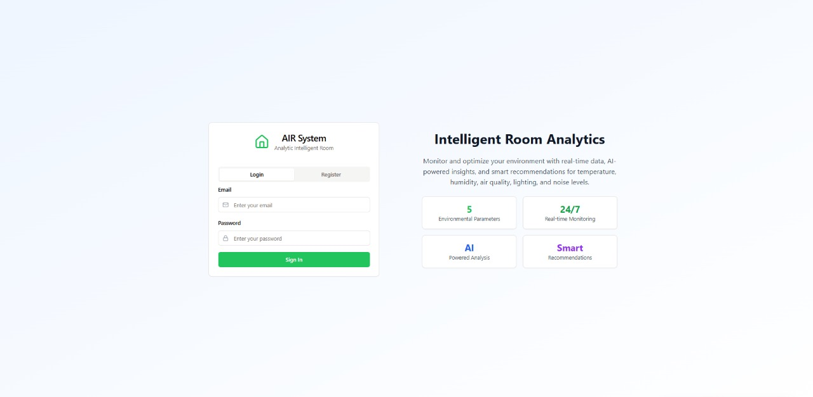
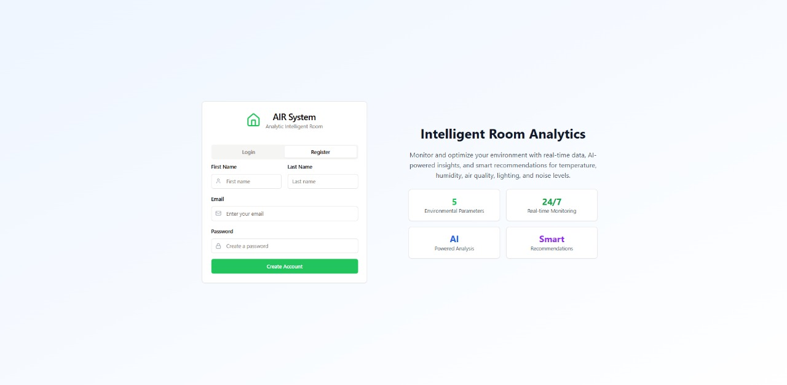
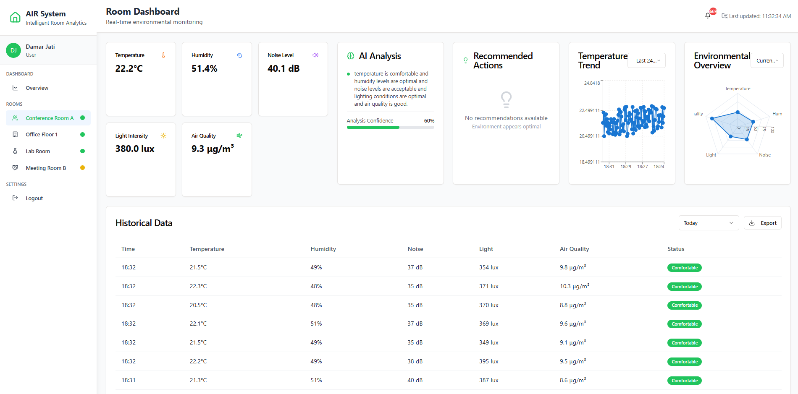
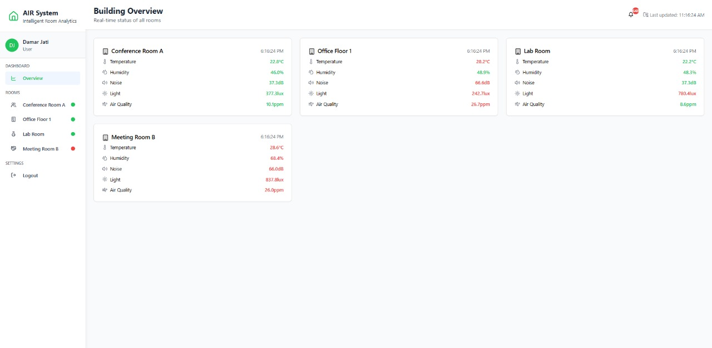

# User Guide – AIR (Analytic Intelligent Room)

## 1. Halaman Login dan Registrasi

### Halaman Login

**Deskripsi:**  
Halaman pertama yang diakses oleh pengguna saat membuka aplikasi.

**Fitur:**
- Login menggunakan akun yang sudah terdaftar.

**Panduan Penggunaan:**
- Masukkan email dan password.
- Klik tombol “Login” untuk masuk ke sistem.

---

### Halaman Registrasi

**Deskripsi:**  
Jika belum memiliki akun, kita dapat mendaftarkan diri melalui halaman ini.

**Fitur:**
- Form registrasi akun baru.

**Panduan Penggunaan:**
- Masukkan data yang diminta seperti nama, email, dan password.
- Klik tombol “Register” untuk membuat akun.

---

## 2. Menu Utama – Room List Page

**Deskripsi:**  
Setelah login berhasil, kita akan diarahkan ke halaman utama yang menampilkan daftar ruangan yang sedang dipantau.

**Contoh Ruangan:**
- Conference Room A
- Office Floor 1
- Lab Room
- Meeting Room B

### Fitur Utama per Ruangan:
Setiap ruangan menampilkan data sensor secara **real-time**, yaitu:
- Suhu ruangan  
- Kelembapan udara  
- Tingkat kebisingan  
- Intensitas cahaya  
- Kualitas udara

### Fitur Tambahan dan Analitik:
1. **AI Analysis**  
   Analisis otomatis berbasis AI terhadap kenyamanan ruangan.

2. **Recommended Action**  
   Saran tindakan berdasarkan hasil analisis AI, seperti: nyalakan AC, buka jendela, atau kurangi kebisingan.

3. **Temperature Trend**  
   Grafik tren suhu berdasarkan rentang waktu yang bisa dipilih:
   - 24 jam terakhir  
   - 7 hari terakhir  
   - 30 hari terakhir

4. **Environmental Overview**  
   Statistik lingkungan dengan mode tampilan:
   - Real-time  
   - Rata-rata mingguan  
   - Rata-rata bulanan

5. **Historical Data**  
   Menampilkan data historis sensor:
   - Hari ini  
   - Kemarin  
   - 7 hari terakhir  
   Data ini juga dapat diunduh dalam format file.

6. **Critical Condition Notifications**  
   Sistem akan memberikan peringatan jika ada:
   - Suhu terlalu tinggi/rendah  
   - Kebisingan melebihi ambang batas  
   - Kualitas udara menurun  
   Notifikasi diberikan untuk **setiap ruangan secara terpisah**.

---

## 3. Halaman Overview – Monitoring Semua Ruangan

**Deskripsi:**  
Halaman ini menyajikan data monitoring dari **semua ruangan secara bersamaan** dalam satu tampilan terpadu.

**Fungsi:**
- Memberikan gambaran umum kondisi semua ruangan secara real-time.
- Membantu pengambilan keputusan cepat dalam skenario darurat atau prioritas pemeliharaan.

---

## 4. Penutup / Konklusi

**Pesan Penutup:**  
Panduan ini menjelaskan alur penggunaan sistem **AIR (Analytic Intelligent Room)**, mulai dari login, pemantauan ruangan, hingga fitur analitik AI.

Dengan sistem ini, kita dapat:
- Mengawasi kondisi lingkungan dengan efisien.  
- Menerima saran otomatis dan notifikasi penting.  
- Melakukan analisis historis serta tindakan preventif berdasarkan data real-time.

---
